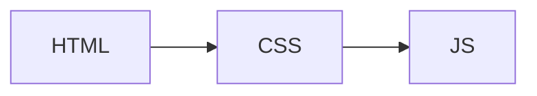

# roadmapper

学習ロードマップを [roadmap.sh](https://roadmap.sh) 風の静的サイトとして出力する Go 製 CLI ツールです。
GitHub Pages / GitLab Pages に **Go のシングルバイナリだけ** で配信できます。Node.js・graphviz・Python 等の外部依存は一切不要です。

## 特徴

- **シングルバイナリ** — Go の `//go:embed` でテンプレート・アセットをすべて同梱
- **YAML + Markdown のハイブリッド入力** — 構造は `roadmap.yml`、本文は `content/<id>.md`
- **DAG レイアウト** — Goja (Pure Go JS engine) + 組み込み dagre.js で自動配置
- **進捗トラッキング** — ノード単位の状態管理・チェックリスト連動・JSON エクスポート/インポート
- **ライト/ダーク テーマ** — `brandColor` 1 つから CSS 変数を自動派生
- **開発サーバ** — ファイル監視 + SSE ライブリロード (`roadmapper dev`)
- **CI 生成** — GitHub Actions / GitLab CI の yaml を自動生成 (`roadmapper deploy`)
- **メタ情報** — OGP タグ・sitemap.xml・RSS フィードを自動生成

## インストール

### Go でビルド (推奨)

```bash
go install github.com/fuchigta/roadmapper/cmd/roadmapper@latest
```

### バイナリを直接ダウンロード

[Releases](https://github.com/fuchigta/roadmapper/releases) から OS に合ったバイナリを取得してください。

## クイックスタート

```bash
# 1. プロジェクトを初期化
roadmapper init my-roadmap --template frontend-beginner
cd my-roadmap

# 2. 設定と本文を編集
$EDITOR roadmap.yml
$EDITOR content/html.md

# 3. 開発サーバで確認 (ファイル保存で自動リロード)
roadmapper dev

# 4. 静的サイトをビルド
roadmapper build

# 5. GitHub Pages 用 CI を生成してプッシュ
roadmapper deploy --target github
git add .github/workflows/pages.yml
git commit -m "ci: add GitHub Pages deployment"
git push
```

## CLI コマンド

| コマンド | 説明 |
|---|---|
| `roadmapper init [dir]` | プロジェクトを初期化する |
| `roadmapper validate` | `roadmap.yml` と `content/` の整合性を検証する |
| `roadmapper build` | `dist/` に静的サイトを出力する |
| `roadmapper dev` | 開発サーバを起動してファイル変更を監視する |
| `roadmapper deploy --target github\|gitlab` | CI/CD ワークフローファイルを生成する |

### `roadmapper init`

```bash
roadmapper init [dir] [flags]

Flags:
  -t, --template string   テンプレート名 (minimal / frontend-beginner) (default "minimal")
```

### `roadmapper build`

```bash
roadmapper build [flags]

Flags:
  -c, --config string   設定ファイルのパス (default "roadmap.yml")
  -o, --out string      出力ディレクトリ (default "dist")
      --base string     ベースパス (例: /my-repo/)
```

GitHub Pages のサブパスにデプロイする場合は `--base /リポジトリ名/` を指定します。`roadmapper deploy` が生成する CI では自動設定されます。

### `roadmapper dev`

```bash
roadmapper dev [flags]

Flags:
  -p, --port int   開発サーバのポート番号 (default 4321)
```

`roadmap.yml` と `content/` ディレクトリを監視し、変更時に自動リビルド・ブラウザリロードします。

### `roadmapper deploy`

```bash
roadmapper deploy --target github   # .github/workflows/pages.yml を生成
roadmapper deploy --target gitlab   # .gitlab-ci.yml を生成
```

既存ファイルがある場合は diff を表示して上書き確認します。

## `roadmap.yml` リファレンス

```yaml
site:
  title: My Learning Roadmaps          # サイトタイトル (必須)
  description: ロードマップの説明
  brandColor: "#4f46e5"               # アクセントカラー (CSS 変数に自動派生)
  author: your-name
  license: CC-BY-4.0
  repo: https://github.com/you/repo   # "この記事を編集" リンクに使用
  editBranch: main
  basePath: ""                         # GH Pages サブパス用 (例: /my-repo/)
  siteUrl: ""                          # 公開 URL (sitemap.xml / RSS / OGP 用)
  layout:
    rankDir: TB                        # TB / LR / BT / RL
    nodeSep: 60
    rankSep: 80

roadmaps:
  - id: frontend                       # URL パスにもなる (必須、ユニーク)
    title: Frontend
    description: ブラウザで動くものを作る人向け
    nodes:
      - id: html
        title: HTML
        type: required                 # required (default) / optional / alternative
        children:
          - id: semantic
            title: Semantic HTML
          - id: forms
            title: Forms
      - id: css
        title: CSS
        parents: [html]               # 複数親 → DAG
        children:
          - id: flexbox
            title: Flexbox
          - id: tailwind
            title: Tailwind CSS
            type: alternative
        links:
          - title: MDN CSS
            url: https://developer.mozilla.org/docs/Web/CSS
```

### ノードタイプ

| type | 表示 | 意味 |
|---|---|---|
| `required` | 実線ボーダー | 必須トピック |
| `optional` | 破線ボーダー | 余裕があれば |
| `alternative` | 破線ボーダー (薄色) | 代替手段のどれか1つ |

## `content/<id>.md` リファレンス

```markdown
---
title: HTML        # 任意 (roadmap.yml の title が正)
links:
  - title: MDN HTML
    url: https://developer.mozilla.org/docs/Web/HTML
---

## 学ぶこと

HTML はウェブページの骨格を作る言語です。

## サブタスク

- [ ] `<article>` と `<section>` の使い分けを説明できる
- [ ] フォームバリデーションを HTML 属性だけで書ける

## サンプルコード

```html
<form>
  <input type="email" required>
</form>
```


```

- `- [ ]` のチェックリストは進捗トラッキングに自動連動します
- mermaid コードブロックはブラウザ側で描画されます
- `links:` は frontmatter と `roadmap.yml` 両方に書けます (frontmatter が優先)

## GitHub Pages へのデプロイ

```bash
roadmapper deploy --target github
```

生成された `.github/workflows/pages.yml` をコミット・プッシュするだけです。
`basePath` は `/${{ github.event.repository.name }}/` に自動設定されます。

## 進捗トラッキング

進捗データは `localStorage` に保存されます。

| 操作 | 効果 |
|---|---|
| ノードをクリック | サイドパネルを開く |
| チェックリストを操作 | 状態を自動更新 (未着手→学習中→完了) |
| 「エクスポート」ボタン | `roadmapper-progress.json` をダウンロード |
| 「インポート」ボタン | JSON ファイルをマージ |

## ライセンス

[Apache License 2.0](LICENSE)
