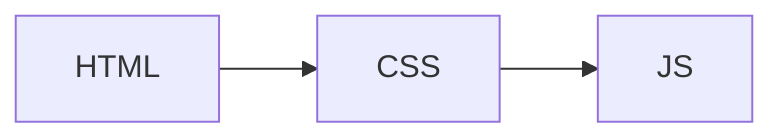

# roadmapper

学習ロードマップを [roadmap.sh](https://roadmap.sh) 風の静的サイトとして出力する Go 製 CLI ツールです。
GitHub Pages / GitLab Pages に **Go のシングルバイナリだけ** で配信できます。Node.js・graphviz・Python 等の外部依存は一切不要です。

## 特徴

- **シングルバイナリ** — Go の `//go:embed` でテンプレート・アセットをすべて同梱
- **YAML + Markdown のハイブリッド入力** — 構造は `roadmap.yml`、本文は `content/<id>.md`
- **DAG レイアウト** — Goja (Pure Go JS engine) + 組み込み dagre.js で自動配置
- **進捗トラッキング** — ノード単位の状態管理・チェックリスト連動・URL シェア
- **ライト/ダーク テーマ** — `brandColor` 1 つから CSS 変数を自動派生
- **開発サーバ** — ファイル監視 + SSE ライブリロード (`roadmapper dev`)
- **CI 生成** — GitHub Actions / GitLab CI の yaml を自動生成 (`roadmapper deploy`)
- **メタ情報** — OGP タグ・sitemap.xml・RSS フィードを自動生成

## インストール

### Go でビルド (推奨)

```bash
go install github.com/fuchigta/roadmapper/cmd/roadmapper@latest
```

### バイナリを直接ダウンロード

[Releases](https://github.com/fuchigta/roadmapper/releases) から OS に合ったバイナリ
(`roadmapper-<os>-<arch>.tar.gz`、Windows は `.zip`。linux / darwin は amd64・arm64、windows は amd64) を取得してください。
`go install` でビルドする場合は `go.mod` の Go バージョン (1.25 以上) が必要です。

## クイックスタート

```bash
# 1. プロジェクトを初期化
roadmapper init my-roadmap --template frontend-beginner
cd my-roadmap

# 2. 設定と本文を編集
$EDITOR roadmap.yml
$EDITOR content/html.md

# 3. 開発サーバで確認 (ファイル保存で自動リロード)
roadmapper dev

# 4. 静的サイトをビルド
roadmapper build

# 5. GitHub Pages 用 CI を生成してプッシュ
roadmapper deploy --target github
git add .github/workflows/pages.yml
git commit -m "ci: add GitHub Pages deployment"
git push
```

## CLI コマンド

| コマンド | 説明 |
|---|---|
| `roadmapper init [dir]` | プロジェクトを初期化する |
| `roadmapper validate` | `roadmap.yml` と `content/` の整合性を検証する |
| `roadmapper build` | `dist/` に静的サイトを出力する |
| `roadmapper dev` | 開発サーバを起動してファイル変更を監視する |
| `roadmapper deploy --target github\|gitlab` | CI/CD ワークフローファイルを生成する |

### `roadmapper init`

```bash
roadmapper init [dir] [flags]

Flags:
  -t, --template string   テンプレート名 (minimal | frontend-beginner | backend-beginner | devops | blank) (default "minimal")
```

| テンプレート | 内容 |
|---|---|
| `minimal` | 最小構成のサンプル (構造を理解する用) |
| `frontend-beginner` | フロントエンド学習ロードマップ (改版履歴・リンク・サブタスクの例入り) |
| `backend-beginner` | バックエンド学習ロードマップ |
| `devops` | DevOps / インフラ学習ロードマップ |
| `blank` | `roadmap.yml` と `content/start.md` のみのスケルトン |

`dir` を省略するとカレントディレクトリに展開します。既存のファイルは上書きせずスキップします。

### `roadmapper validate`

```bash
roadmapper validate [flags]

Flags:
  -c, --config string   設定ファイルのパス (default "roadmap.yml")
      --strict          content/*.md が見つからないノードや改版履歴の警告があればエラーで終了する
```

`roadmap.yml` の必須項目・ID の重複・親ノードの存在・`type` / `difficulty` の値・`progressSync` / `panel` / `analytics` の設定・
改版履歴の日付形式、およびグラフの循環参照を検証します (違反はエラー)。
`content/*.md` が見つからないノードと改版履歴の不整合は warning として表示し、`--strict` 指定時のみ exit code 1 になります。

### `roadmapper build`

```bash
roadmapper build [flags]

Flags:
  -c, --config string   設定ファイルのパス (default "roadmap.yml")
  -o, --out string      出力ディレクトリ (default "dist")
      --base string     ベースパス (例: /my-repo/)
      --no-analytics    アクセス解析タグを出力しない
```

GitHub Pages のサブパスにデプロイする場合は `--base /リポジトリ名/` を指定します。`roadmapper deploy` が生成する CI では自動設定されます。

### `roadmapper dev`

```bash
roadmapper dev [flags]

Flags:
  -c, --config string   設定ファイルのパス (default "roadmap.yml")
  -o, --out string      出力ディレクトリ (default "dist")
  -p, --port int        開発サーバのポート番号 (default 4321)
```

`roadmap.yml` と `content/` ディレクトリ (サブディレクトリを含む) を監視し、変更時に自動リビルド・ブラウザリロードします。

### `roadmapper deploy`

```bash
roadmapper deploy --target github   # .github/workflows/pages.yml を生成
roadmapper deploy --target gitlab   # .gitlab-ci.yml を生成

Flags:
  -t, --target string   デプロイ先 (github / gitlab) (必須)
```

生成する CI は、GitHub Releases の最新バイナリ (`roadmapper-linux-amd64.tar.gz`) をダウンロードして
`roadmapper build --base "/<リポジトリ名>/"` を実行します (`main` ブランチへの push で起動)。
`-c` / `-o` は指定できず、カレントディレクトリの `roadmap.yml` を `dist/` へビルドします
(GitLab では `dist` を `public` に移動)。`roadmap.yml` が別の場所にある場合は生成後のファイルを編集してください。
既存ファイルがある場合は diff を表示して上書き確認します。

## `roadmap.yml` リファレンス

```yaml
site:
  title: My Learning Roadmaps          # サイトタイトル (必須)
  description: ロードマップの説明
  brandColor: "#4f46e5"               # アクセントカラー (CSS 変数に自動派生)
  author: your-name
  license: CC-BY-4.0
  repo: https://github.com/you/repo   # "この記事を編集" リンクに使用
  editBranch: main
  basePath: ""                         # GH Pages サブパス用 (例: /my-repo/)
  siteUrl: ""                          # 公開 URL (sitemap.xml / RSS / OGP の og:url 用)
  analytics:                           # アクセス解析 (任意, 詳細は「アクセス解析」)
    provider: umami                    # umami / plausible / goatcounter / custom (空なら無効)
    scriptUrl: https://analytics.example.com/script.js
    siteId: your-website-id
  panel:                               # 記事サイドパネルの幅 (px)
    width: 520                         # 初期幅
    minWidth: 320                      # 最小幅
    maxWidth: 960                      # 最大幅 (画面幅の 80% も上限)
  layout:
    rankDir: TB                        # TB / LR / BT / RL
    nodeSep: 50
    rankSep: 80
  progressSync: {}                     # 進捗のバックエンド同期 (後述)
  contentAssets: {}                    # content/ 内の静的ファイルのコピー設定 (後述)

roadmaps:
  - id: frontend                       # URL パスにもなる (必須、ユニーク)
    title: Frontend
    description: ブラウザで動くものを作る人向け
    nodes:
      - id: html
        title: HTML
        type: required                 # required (default) / optional / alternative
        children:
          - id: semantic
            title: Semantic HTML
          - id: forms
            title: Forms
      - id: css
        title: CSS
        parents: [html]               # 複数親 → DAG
        difficulty: beginner          # beginner / intermediate / advanced (任意)
        estimatedTime: "3d"           # 推定所要時間 (任意, 例: "2h", "3d")
        content: frontend/css         # content/frontend/css.md を明示指定 (任意, 拡張子なし)
        x: 300                        # 手動 X 座標 (任意, 自動レイアウトを上書き)
        y: 200                        # 手動 Y 座標 (任意, 自動レイアウトを上書き)
        children:
          - id: flexbox
            title: Flexbox
          - id: tailwind
            title: Tailwind CSS
            type: alternative
        links:
          - title: MDN CSS
            url: https://developer.mozilla.org/docs/Web/CSS
```

各ロードマップには `changelog` (改版履歴) も書けます (後述)。

### 既定値と検証

| キー | 既定値 |
|---|---|
| `site.brandColor` | `#4f46e5` |
| `site.editBranch` | `main` |
| `site.layout.rankDir` / `nodeSep` / `rankSep` | `TB` / `50` / `80` |
| `site.panel.width` / `minWidth` / `maxWidth` | `520` / `320` / `960` (指定済みの値と矛盾しない範囲に補正) |
| `site.analytics.events` / `excludeSearch` | `true` / `true` |
| `roadmaps[].nodes[].type` | `required` |

`roadmapper validate` / `build` は次を検証します。

- `site.title`、`roadmaps` (1 件以上)、各ロードマップの `id` (ユニーク) / `title`、各ノードの `id` (ユニーク、`__order` は予約済み) / `title` は必須
- `parents` は同一ロードマップ内の既存ノードを指すこと (循環参照はグラフ構築時にエラー)
- `type` は `required` / `optional` / `alternative`、`difficulty` は `beginner` / `intermediate` / `advanced`
- `progressSync.enabled: true` のときは `endpoint` が必須で、`http://` または `https://` で始まること
- `analytics.provider` は `umami` / `plausible` / `goatcounter` / `custom` のいずれか (空なら無効)。`custom` 以外は `scriptUrl` (`http://` / `https://`) と `siteId` が必須、`custom` は `head` が必須
- `panel` の各値は負でなく、`minWidth <= width <= maxWidth` であること
- `changelog` の `date` は `YYYY-MM-DD`、`summary` は必須、`nodes` は同一ロードマップのノード ID であること

### ノードタイプ

| type | 表示 | 意味 |
|---|---|---|
| `required` | 濃色の塗り | 必須トピック |
| `optional` | 薄色の塗り + グレー枠、`opt` バッジ、エッジは破線 | 余裕があれば |
| `alternative` | 紫系の塗り + `alt` バッジ、エッジは破線 | 代替手段のどれか1つ |

`difficulty` を指定するとノード左上に 初 / 中 / 上 のバッジが表示され、サイドパネルにも難易度と
`estimatedTime` が表示されます。

## `content/<id>.md` リファレンス

```markdown
---
title: HTML        # 任意 (roadmap.yml の title が正)
links:
  - title: MDN HTML
    url: https://developer.mozilla.org/docs/Web/HTML
---

## 学ぶこと

HTML はウェブページの骨格を作る言語です。

## サブタスク

- [ ] `<article>` と `<section>` の使い分けを説明できる
- [ ] フォームバリデーションを HTML 属性だけで書ける

## サンプルコード

```html
<form>
  <input type="email" required>
</form>
```


```mermaid
graph LR; HTML --> CSS --> JS
```
```

- `- [ ]` のチェックリストは進捗トラッキングに自動連動します (初期状態は常に未チェックで、`- [x]` は初期値になりません)
- mermaid コードブロックはブラウザ側で描画されます (mermaid ライブラリを CDN (cdn.jsdelivr.net) から読み込むため、オフラインでは図が表示されません。mermaid を含むロードマップページのみ読み込まれます)
- frontmatter の `updated` / `changes` は改版履歴用です (後述)
- `links:` は frontmatter と `roadmap.yml` 両方に書けます (frontmatter が優先)

### content/ のサブディレクトリ

`content/` 配下は再帰的にスキャンされ、ノード ID と次の優先順で解決されます:

1. ノードに `content: <path>` が指定されていればそのパス (拡張子なし) を引く
2. `content/<id>.md` (ID 自体がスラッシュ区切りパスの場合は `content/<id>.md` 直接)
3. ファイル名末尾フォールバック (`content/frontend/html.md` → ID `html` で解決)

複数サブディレクトリに同名ファイルがある場合、末尾名フォールバックは曖昧になり
登録されません。その場合は明示的に `content:` で指定するか、ID 側を
`frontend/html` のようなパス形式にしてください。

```yaml
- id: html
  title: HTML
  content: frontend/html      # content/frontend/html.md を参照
```

ビルド時にノードに対応する `.md` が見つからなかった場合は warning がログに
出力されます。`roadmapper validate` でも同じ警告を出し、`--strict` を付けると
未解決ノードがあれば exit code 1 で終了します (CI でブロックしたい場合に有用)。

### 画像など静的ファイルの参照

`content/` 配下に画像や PDF などの非 `.md` ファイルを置くと、ビルド時に
`dist/content/` に同じ構造でコピーされます。マークダウン内では現在の `.md`
からの**相対パス**で参照してください。

```text
content/
├── frontend/
│   ├── html.md
│   └── images/
│       └── dom.png
```

```markdown
<!-- content/frontend/html.md 内 -->

```

ビルド時に URL は `dist/{roadmapId}/index.html` から正しく解決されるパス
(例: `../content/frontend/images/dom.png`) に自動で書き換えられます。
`basePath` が設定されている場合も同様に正しいパスへ書き換わります。

絶対 URL (`https://…`)、ルート相対パス (`/foo`)、`mailto:`、フラグメント
(`#section`) はそのまま保持されます。

#### コピー対象から除外する

```yaml
site:
  contentAssets:
    exclude:
      - "**/drafts/**"
      - "*.psd"
      - "**/raw/*"
```

`*` は単一セグメント、`**` は 0 個以上のセグメントにマッチします (doublestar 風)。
`*.psd` は `content/` 直下にだけ一致するため、サブディレクトリ内も除外するには `**/*.psd` と書きます。
パターンは `content/` からの相対パスに対して評価されます。
`.` で始まる隠しディレクトリは常にスキャン対象外です。

## 改版履歴 (changelog)

ロードマップの更新履歴を 2 か所で書けます。日付はすべて `YYYY-MM-DD` 形式です。

**roadmap.yml** — ロードマップ全体に関わる変更 (構成の見直し、複数ノードにまたがる変更)

```yaml
roadmaps:
  - id: frontend
    changelog:
      - date: 2026-09-20
        summary: フォームの章を追加
        nodes: [html]        # 関連ノード ID (任意)
```

**content/*.md の frontmatter** — そのノード自身の変更

```yaml
---
updated: 2026-09-20          # 最終更新日
changes:
  - date: 2026-09-20
    summary: アクセシビリティの説明を追記
---
```

両者は 1 つの履歴 (日付降順) に集約され、次の場所に表示されます。

- ロードマップページのヘッダー (最新の更新日・履歴)
- サイドパネル (ノードごとの履歴)
- インデックスのロードマップカード
- SVG の「更新」バッジ (最終更新から 30 日以内のノード。ホバーで更新日を表示)
- RSS フィード (`siteUrl` 設定時)。履歴のあるロードマップは、ノードごとではなく履歴項目ごとに
  item を出力します (`pubDate` は項目の日付、1 ノードに紐づく項目はそのノードへのリンク付き)

`roadmapper validate` は、未来の日付や、`updated` が `changes` / roadmap.yml の changelog より古い
といった不整合を警告します。`--strict` を付けると警告があれば失敗します (日付形式の誤りは常にエラー)。

## OGP / sitemap / RSS

`site.siteUrl` を設定すると、ビルド時に `sitemap.xml` と `feed.rss` が出力され、ページの `og:url` が付きます。
`siteUrl` が空のときは sitemap・RSS を生成せず、`og:url` も付きません (`og:title` / `og:description` / `og:type` は常に出力)。
URL は `siteUrl` + `basePath` (末尾スラッシュ補完) + `<roadmapId>/index.html` の形で組み立てます。

## GitHub Pages へのデプロイ

```bash
roadmapper deploy --target github
```

生成された `.github/workflows/pages.yml` をコミット・プッシュするだけです。
`basePath` は `/${{ github.event.repository.name }}/` に自動設定されます
(`--base` が `site.basePath` より優先されるため、CI のビルドでは `site.basePath` は使われません)。
リポジトリの Settings → Pages で Source を **GitHub Actions** にしてください。
GitLab Pages の場合は `roadmapper deploy --target gitlab` で `.gitlab-ci.yml` を生成します。

## 進捗トラッキング

進捗データは `localStorage` に保存されます。

| 操作 | 効果 |
|---|---|
| ノードをクリック | サイドパネルを開く |
| チェックリストを操作 | 状態を自動更新 (未着手→学習中→完了) |
| パネル上部のドロップダウン | 状態を手動設定 (未着手 / 学習中 / 完了 / スキップ) |
| シェアボタン | 進捗を埋め込んだ URL (`?p=...`) を生成。開いた側は読み取り専用表示で、保存・同期はされません |

localStorage のキーは `roadmapper:progress` です。

## 進捗のバックエンド同期

`progressSync` を設定すると、複数デバイス間で進捗を同期できます。

```yaml
site:
  progressSync:
    enabled: true
    endpoint: https://api.example.com/sync  # サイト作者が用意するサーバ
```

### HTTP コントラクト

| メソッド | パス | 概要 |
|---|---|---|
| `GET` | `{endpoint}/{deviceId}/{roadmapId}` | ロードマップ進捗を取得 |
| `PUT` | `{endpoint}/{deviceId}/{roadmapId}` | ロードマップ進捗を保存 |

- `deviceId` はブラウザ初回アクセス時に `crypto.randomUUID()` で自動生成 (localStorage の `roadmapper:deviceId`)
- `endpoint` は `http://` / `https://` で始まる末尾スラッシュなしの URL
- GET は `Accept: application/json` で呼ばれ、`404` は「データなし」として扱われます。その他の非 2xx 応答やネットワークエラーは無視されます
- PUT ボディ: `{ "<nodeId>": { "state": "done", "tasks": [true, false] }, ... }` (`state` は `none` / `in-progress` / `done` / `skipped`)
- サーバは冪等な全置換で実装すればよい
- 起動時に取得したリモート進捗はローカルとマージされます。ノードごとに進んでいる方を採用し (`none` < `in-progress` < `done` / `skipped`、同ランクは `done` 優先)、`tasks` は OR で結合します
- PUT は状態変更の 800ms 後 (デバウンス) に送信されます。失敗時は dirty フラグを残し、`online` イベントや次回ロード時に再送します

### CORS 設定 (必須)

PUT に `Content-Type: application/json` を付けるため、サーバは preflight (OPTIONS) に応答する必要があります:

```
Access-Control-Allow-Origin: https://your-site.example.com
Access-Control-Allow-Methods: GET, PUT, OPTIONS
Access-Control-Allow-Headers: Content-Type
```

### 最小サーバ実装例 (Cloudflare Workers)

```js
export default {
  async fetch(req) {
    const cors = {
      'Access-Control-Allow-Origin': '*',
      'Access-Control-Allow-Methods': 'GET, PUT, OPTIONS',
      'Access-Control-Allow-Headers': 'Content-Type',
    };
    if (req.method === 'OPTIONS') return new Response(null, { status: 204, headers: cors });
    const [, deviceId, roadmapId] = new URL(req.url).pathname.split('/');
    const key = `${deviceId}/${roadmapId}`;
    if (req.method === 'GET') {
      const val = await MY_KV.get(key);
      return val
        ? new Response(val, { headers: { ...cors, 'Content-Type': 'application/json' } })
        : new Response('{}', { status: 404, headers: cors });
    }
    if (req.method === 'PUT') {
      await MY_KV.put(key, await req.text());
      return new Response(null, { status: 204, headers: cors });
    }
    return new Response('Method Not Allowed', { status: 405 });
  }
};
```

`MY_KV` は Cloudflare Workers KV バインディングです。認証はリバースプロキシや Cloudflare Access で付与してください。

## アクセス解析

`site.analytics` を設定すると、生成する全ページの `<head>` に解析タグを埋め込みます。Cookie を使わない
セルフホスト/軽量サービス (umami / Plausible / GoatCounter) を想定しており、`provider` が空なら何も出力しません。

```yaml
site:
  analytics:
    provider: umami                     # umami / plausible / goatcounter / custom
    scriptUrl: https://analytics.example.com/script.js   # http:// または https:// (custom 以外は必須)
    siteId: 11111111-2222-3333-4444-555555555555         # custom 以外は必須
    domains: [your-name.github.io]      # umami のみ: 計測を許可するホスト名 (推奨)
    events: true                        # 利用イベントの送信 (既定 true)
    excludeSearch: true                 # クエリ文字列を記録しない (既定 true, umami のみ)
```

| provider | `siteId` の意味 | 出力されるタグ |
|---|---|---|
| `umami` | `data-website-id` | `<script defer src=... data-website-id=... data-domains=... data-exclude-search="true">` |
| `plausible` | `data-domain` | `<script defer data-domain=... src=...>` |
| `goatcounter` | `data-goatcounter` (例: `https://xxx.goatcounter.com/count`) | `<script data-goatcounter=... async src=...>` |
| `custom` | (未使用) | `head` の内容をそのまま挿入 |

サービスに対応する属性がない設定 (例: Plausible の `excludeSearch`) は無視されます。
`domains` を指定すると、`localhost` やフォークされたサイトからの計測を除外できます。

### custom (GA4 など)

`provider: custom` では `head` を `<head>` にそのまま挿入します。信頼できる内容のみ記述してください。

```yaml
site:
  analytics:
    provider: custom
    head: |
      <script async src="https://www.googletagmanager.com/gtag/js?id=G-XXXXXXX"></script>
      <script>
        window.dataLayer = window.dataLayer || [];
        function gtag(){dataLayer.push(arguments);}
        gtag('js', new Date());
        gtag('config', 'G-XXXXXXX');
        // 任意: roadmapper のイベントを GA4 に転送する
        window.roadmapperTrack = function (name, data) { gtag('event', name, data); };
      </script>
```

### 送信するイベント

各 provider 用のアダプタが `window.roadmapperTrack(name, data)` を定義し、`events: true` の間だけ以下を送ります
(custom では利用者が `roadmapperTrack` を定義した場合のみ送信されます)。

| イベント | データ | 送信タイミング |
|---|---|---|
| `node_open` | `roadmap`, `node` | ノードの記事パネルを開いたとき |
| `node_state` | `roadmap`, `node`, `state` | ノードの進捗状態を変更したとき (シェアビューでは送らない) |
| `share` | `roadmap` | 共有ボタンを押したとき |
| `outbound` | `roadmap`, `node`, `url` | パネル内の外部リンクをクリックしたとき |

### プライバシー

- 端末の匿名 ID (`deviceId`) や進捗データ、シェア URL の `?p=...` の値はイベントに含めません。
- umami では既定で `data-exclude-search="true"` を付け、シェア URL のクエリ文字列を記録しません。
- `roadmapper dev` では常に無効です。本番ビルドでも無効にしたいときは `roadmapper build --no-analytics` を使います。

## ライセンス

[Apache License 2.0](LICENSE)
