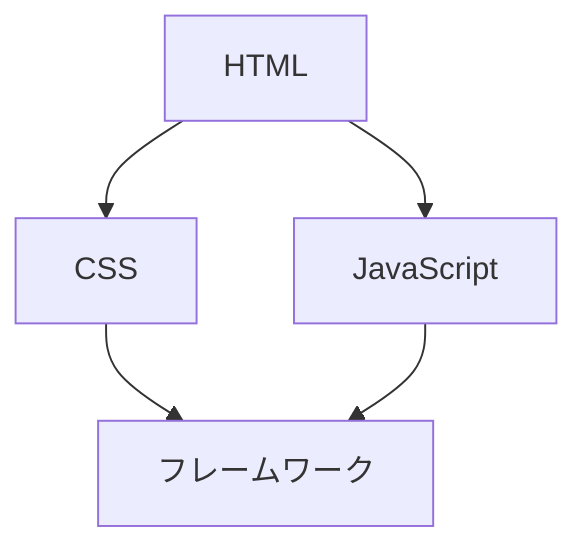

---
links:
  - { title: "Mermaid 公式ドキュメント", url: "https://mermaid.js.org/" }
---

## Mermaid 図の埋め込み

`mermaid` フェンスを使うと、テキストから図を自動生成できます。

````markdown

````

## 対応している図の種類

| 種類 | 説明 |
|---|---|
| `graph` / `flowchart` | フローチャート |
| `sequenceDiagram` | シーケンス図 |
| `classDiagram` | クラス図 |
| `gantt` | ガントチャート |
| `pie` | 円グラフ |
| `erDiagram` | ER 図 |

## 描画タイミング

Mermaid のレンダリングはブラウザ側で実行されます。
サイドパネルを開いたタイミングで図が描画されます。

> **注意**: Mermaid ライブラリは CDN から読み込まれるため、
> オフライン環境では図が表示されない場合があります。

## サブタスク

- [ ] \`\`\`mermaid フェンスで図を記述した
- [ ] `dev` サーバで図が正しく描画されることを確認した
